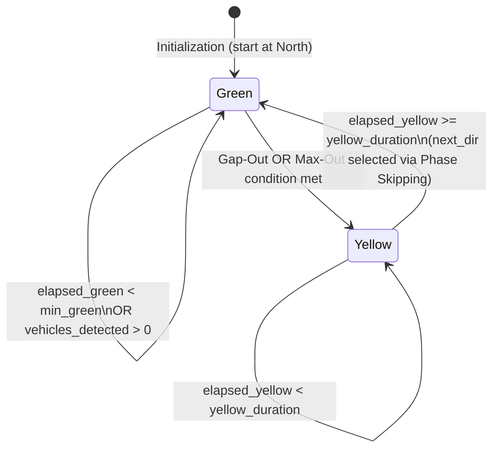

# Algorithms

This document details the mathematical formulas, state machines, and decision logic that power the adaptive traffic light controller.

---

## 1. Time Extension State Machine

The controller operates as a two-state machine per simulation tick (0.1s step):



---

## 2. Green Phase Transition Logic (Gap-Out & Max-Out)

Every 0.1-second step, `decide_yellow_transition()` evaluates the active green phase:

```
elapsed_green += step_length (0.1s)

IF elapsed_green >= min_green:
    IF vehicles_detected == 0 AND camera_healthy:
        → GAP-OUT  (transition to Yellow immediately)
    ELIF elapsed_green >= max_green:
        → MAX-OUT  (transition to Yellow, max limit enforced)
    ELSE:
        → KEEP     (continue green, vehicles still present)
ELSE:
    → KEEP     (minimum green time not yet reached)
```

### Parameters

| Parameter | Default | Description |
| :--- | :--- | :--- |
| `min_green` | `10.0s` | Minimum guaranteed green duration before Gap-Out is allowed |
| `max_green` | `50.0s` | Maximum allowed green duration before forced Max-Out |
| `yellow_duration` | `4.0s` | Fixed yellow phase duration before switching to next green |

### Gap-Out Rationale

`min_green` exists to prevent rapid flickering between green and yellow when a lane momentarily empties mid-cycle. Without it, a brief gap in traffic could trigger a premature transition even when a dense wave of vehicles is approaching.

---

## 3. Phase Skipping Algorithm

When transitioning to the next green direction, `select_next_direction()` performs a **circular queue scan**:

```
sequence = [N, E, S, W]
curr_idx = index of current_direction

FOR i in [1, 2, 3, 4]:
    candidate = sequence[(curr_idx + i) % 4]

    IF Dual Mode AND candidate shares same phase as current:
        CONTINUE  (skip: both already green simultaneously)

    queue_count = get_queue(candidate)
    IF Dual Mode:
        queue_count += get_queue(counterpart[candidate])

    IF queue_count > 0:
        IF i > 1:
            PRINT "[SKIP] Skipping empty directions: ..."
        RETURN candidate

RETURN current_direction  (all others empty, keep current green)
```

### Phase Skipping Example (Single Mode)

```
Current: North (Green)
Queue:   North=0, East=0, South=5, West=12

Scan:
  i=1 → East   (queue=0) → SKIP
  i=2 → South  (queue=5) → SERVE

Result: [SKIP] Phase Skipping active! Skipping empty directions: East.
        [GREEN] GREEN light active in direction South.
```

### Phase Skipping in Dual Mode

In Dual Mode, N and S share **the same green phase index**. When North is active, South is automatically green as well. The skipping logic filters out same-phase counterparts to avoid duplicate or contradictory transitions.

---

## 4. Dual Mode Bidirectional Camera Merging

In Dual Mode (opposites layout), two directions share a single green phase. To decide whether to Gap-Out, the controller must consider **both directions of the axis** simultaneously:

```
vehicles_detected = get_active_vehicles(current_direction)
                  + get_active_vehicles(counterpart[current_direction])

is_healthy = cams_healthy[current_direction]
           AND cams_healthy[counterpart[current_direction]]
```

This prevents premature Gap-Out on a shared axis when one direction is empty but the opposite is still receiving traffic.

---

## 5. Estimated Red Wait Time Formula

For each direction currently on red, the GUI timer displays a dynamically computed estimated wait time.

### Single Mode

```
steps_away = (target_idx - curr_idx) % 4

estimated_wait = remaining_current_phase
               + Σ (min_green + yellow_duration)
                   for each intermediate direction with queue > 0
```

Where `remaining_current_phase` is:
```
IF currently Yellow:
    remaining = yellow_duration - elapsed_yellow

ELIF currently Green AND elapsed_green < min_green:
    remaining = (min_green - elapsed_green) + yellow_duration

ELIF currently Green AND vehicles > 0:
    remaining = (max_green - elapsed_green) + yellow_duration

ELIF currently Green AND vehicles == 0:
    remaining = yellow_duration  (imminent Gap-Out)
```

### Dual Mode

```
IF target shares same phase as current:
    estimated_wait = 0.0  (already green!)

ELSE:
    estimated_wait = remaining_current_phase
                     (same formula as above, using merged vehicle count)
```

### Initial Red Wait Anchor

When a direction transitions from green to yellow, the system **records a snapshot** of its estimated wait at that moment (`initial_red_wait[direction]`). The GUI displays:

```
Red: {int(rem)}s / {int(total)}s
```

The denominator `total` is anchored at the value recorded at transition time, creating a countdown that visually depletes from `total` to `0`. If the real-time estimate ever exceeds the stored anchor (due to unexpected congestion ahead), the anchor is updated automatically.
