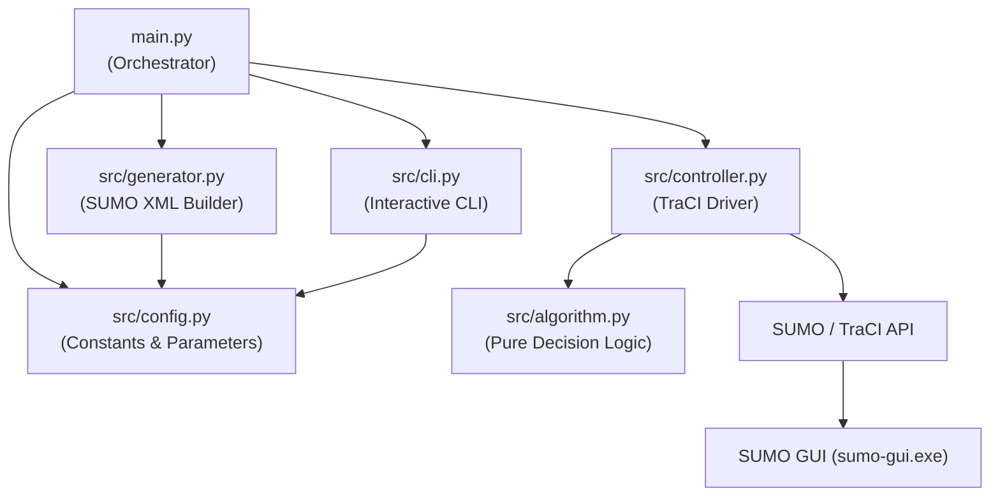
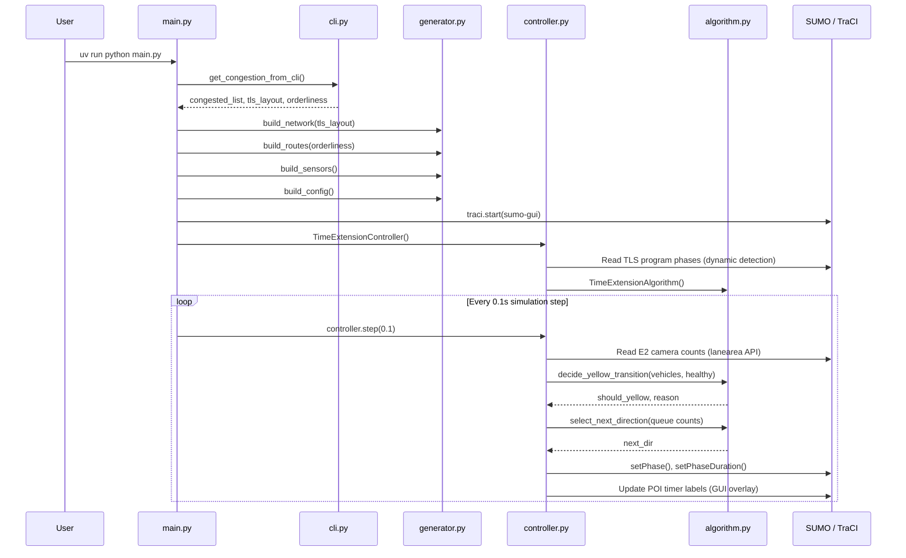

# Architecture

This document explains the software architecture, module responsibilities, and design patterns applied in the SUMO Adaptive Traffic Light Simulator.

---

## Module Dependency Graph



---

## Execution Flow



---

## Design Pattern: Strategy (Decoupled Architecture)

The system applies the **Strategy Pattern** to fully separate the simulator binding layer from the adaptive control logic.

### Problem Statement
Tightly coupling TraCI API calls with decision logic creates several issues:
- Algorithm logic **cannot be unit tested** without launching a SUMO instance.
- Swapping to a different algorithm (e.g., Reinforcement Learning) requires **rewriting the entire controller**.
- Code becomes harder to read because simulator commands are interleaved with math.

### Solution: Two-Class Separation

| Class | File | Responsibility |
| :--- | :--- | :--- |
| `TimeExtensionAlgorithm` | `src/algorithm.py` | Pure mathematical decision engine. No TraCI imports. |
| `TimeExtensionController` | `src/controller.py` | TraCI driver: reads sensors, passes data to algorithm, sends commands to SUMO. |

```
TimeExtensionController (TraCI Driver)
│
│  reads sensor data from:
│   └── traci.lanearea.getLastStepVehicleNumber()
│   └── traci.lanearea.getJamLengthVehicle()
│
│  passes numeric data to:
│   └── TimeExtensionAlgorithm.decide_yellow_transition()
│   └── TimeExtensionAlgorithm.select_next_direction()
│   └── TimeExtensionAlgorithm.get_timer_text()
│
│  executes decisions by calling:
│   └── traci.trafficlight.setPhase()
│   └── traci.trafficlight.setPhaseDuration()
│   └── traci.poi.setType()  (GUI overlay)
```

`TimeExtensionAlgorithm` communicates with controller data **exclusively through pure Python callback functions** (`get_vehicles_fn`, `get_queue_fn`), never importing or touching TraCI directly.

---

## Dynamic TLS Layout Detection

SUMO builds a different number of traffic light phases depending on the `--tls.layout` argument passed to `netconvert`:

| Layout | Phases | Description |
| :--- | :--- | :--- |
| `incoming` | 8 | Each of four directions gets an independent green + yellow phase |
| `opposites` | 4 | Opposite pairs (N-S and E-W) share a single green + yellow phase |

At startup, `TimeExtensionController` reads the active TLS program **from the running SUMO instance via TraCI** and sets the correct phase index mapping automatically:

```python
logics = traci.trafficlight.getAllProgramLogics(tls_id)
num_phases = len(logics[0].phases)
self.is_dual_mode = (num_phases <= 4)
```

This eliminates the need for any manual configuration flag when switching between Single and Dual modes.

---

## Failsafe Sensor Mechanism

E2 lane area detectors (cameras) can fail at runtime due to network ID mismatches or SUMO internal issues, raising `traci.exceptions.TraCIException`.

The failsafe mechanism operates as follows:

1. **On first `TraCIException`**: The camera for that direction is marked unhealthy (`cams_healthy[direction] = False`).
2. **Subsequent reads**: Instead of calling TraCI, the system **returns `999` vehicles** — an artificially high count that prevents Gap-Out from triggering on that direction.
3. **Effect**: The failing direction will eventually Max-Out normally, giving it its fair share of green time without any special handling. The simulation continues without crashing.

---

## GUI Overlay: POI Timer Labels

Each approach direction has a **Point of Interest (POI)** object placed near the intersection center in SUMO GUI. These POIs are used as text label containers:

- **Green phase**: `Green: 38s/50s` (countdown to Max-Out)
- **Yellow phase**: `Yellow: 3s/4s` (countdown to green transition)
- **Red phase**: `Red: 22s/47s` (estimated dynamic wait countdown)

POI positions are offset from the junction center using `traci.junction.getPosition()`, with each direction offset in the corresponding compass direction so labels do not overlap.
